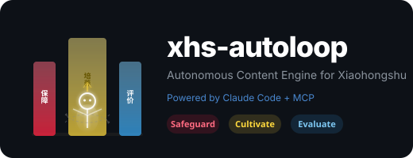

<p align="center">
  
</p>

<p align="center">
  <strong>让 Claude Code 全自动运营你的小红书：选题 · 写稿 · 发布 · 追踪 · 反思 · 迭代</strong>
</p>

<p align="center">
  <a href="#快速开始">快速开始</a> &nbsp;|&nbsp;
  <a href="#核心哲学保障--培养--评价">核心哲学</a> &nbsp;|&nbsp;
  <a href="#自定义指南">自定义</a> &nbsp;|&nbsp;
  <a href="#faq">FAQ</a>
</p>

---

## 它是什么

xhs-autoloop 是一个 **7×24 无人值守的小红书内容引擎**。它不是一个发帖脚本——它是一个能自己选题、自己写、自己发、自己看数据、自己反思的自主循环系统。

你配好服务器，扫码登录一次小红书，启动 `setup.sh`，然后去睡觉。剩下的它来。

```
┌─ cron (*/10) ─── watchdog.sh ──────────────────────────────┐
│                                                             │
│   ┌─────────┐   ┌─────────┐   ┌─────────┐   ┌──────────┐  │
│   │ 查数据  │──>│  反思   │──>│ 选题+写 │──>│ 发布+验证│  │
│   │search   │   │赞藏比   │   │curl信源  │   │publish   │  │
│   │_feeds   │   │分析策略  │   │原创内容  │   │search确认│  │
│   └─────────┘   └─────────┘   └─────────┘   └──────────┘  │
│         ^                                          │        │
│         └──────── metrics.jsonl <───────────────────┘        │
└─────────────────────────────────────────────────────────────┘
```

## 核心哲学：保障 · 培养 · 评价

这套系统背后的设计理念来自一个核心问题：**怎么信任一个 AI Agent 在你不看的时候独立工作？**

答案是三层闭环。这三层是通用的——不只是小红书，任何你想让 Agent 自主运行的场景都需要它们。

### 1. 保障（Safeguard）

> 确保系统永远在跑。不指望单次运行一定成功，而是确保能从任何失败中自动恢复。

Agent 会遇到各种意外：API 断了、网络抖动、MCP 重启、prompt 被截断。你不可能 24 小时盯着它。所以需要一个**独立于 Agent 的保活机制**：

| 机制 | 说明 |
|------|------|
| Watchdog cron | 每 10 分钟检查心跳，判断是否该启动新一轮 |
| 失败重试 | 失败后 30 分钟自动重试，不需要人工干预 |
| 正常间隔 | 成功后按配置间隔继续（默认 4 小时） |
| 过期停止 | mission 到期自动停止，不会无限跑 |
| tmux 隔离 | 每轮在独立 tmux session 中运行，一轮崩溃不影响下一轮 |
| 防重入 | 检测到上一轮还在跑时自动跳过，不会重复启动 |

### 2. 培养（Cultivate）

> 不指望 Agent 一次就会。手把手带走完流程，踩完坑沉淀经验，直到产出达到你的基准。

AI Agent 不是开箱即用的。第一次一定要手把手带它走完全流程：

1. 手动运行一轮，看它哪里做错了
2. 修正约束，补充遗漏的规则
3. 让它独立跑一轮，验证是否"出师"
4. 出了问题继续调整，直到产出达到你的基准
5. 经验沉淀下来

这就像带新人：你不会第一天就让实习生独立上线，但你也不会每天帮他写代码。**培养的目标是让 Agent 的平均产出达到你一般状态下的水准。**

经验沉淀有三个层次，各有分工：

| 层次 | 作用 | 对应文件 |
|------|------|---------|
| **Prompt** | 每轮注入的硬规则和策略。"不要用 Markdown"、"标题不超过 15 字"。 | `config/prompt-template.md` |
| **Skill** | 可复用的能力模块。当 Agent 反复需要某个复杂流程时，封装成 [Claude Code Skill](https://docs.anthropic.com/en/docs/claude-code/skills)，下次直接调用。 | `~/.claude/skills/` |
| **脚本** | Agent 之外的确定性自动化。调度、保活、数据采集。Agent 负责"思考和创作"，脚本负责"调度和保活"。 | `scripts/` |

本项目自带的就是培养的成果：从实际运行中踩过的坑（纯文本格式、真实信源）、被验证有效的内容策略（标题情绪化 + 正文干货化）、从数据中学到的反思框架（赞藏比分析）、以及稳定运行的调度脚本（watchdog + cron + tmux 三件套）。

### 3. 评价（Evaluate）

> 用客观的、独立于 Agent 的指标驱动反思。Agent 自己说"写得不错"毫无意义。

任何 Agent 都可能自信地汇报完成了任务，但实际上没有。如果你让它自己评价内容质量，它永远说好。

解决方法是给它一个**客观的、它无法伪造的评价指标**：

- **点赞 + 收藏 = score**（来自真实用户，Agent 无法操控）
- 每轮循环**必须**查上一轮的实际数据
- 赞藏比揭示真实问题：藏>赞=有价值缺情绪，赞>藏=有共鸣缺干货，双低=选题问题
- 持续低分的内容类型会被自动放弃

当 Agent 看到"这篇 0 赞 0 藏"vs"那篇 18 赞 21 藏"，它的反思才是真实的。**评价体系把 Agent 从自嗨模式拉到对结果负责模式。**

```
保障：系统在你睡觉时也不会停
  └─> 培养：每一轮 Agent 都比上一轮更熟练
        └─> 评价：客观数据，不靠 Agent 自我感觉
              └─> 反馈回保障：数据异常自动触发修正
```

## 前置条件

| 依赖 | 说明 |
|------|------|
| Linux 服务器 | 1C1G 即可，需要 `jq`、`tmux`、`cron` |
| [Claude Code](https://docs.anthropic.com/en/docs/claude-code) | 已安装，可 headless 运行（`claude --print`） |
| [xiaohongshu-mcp](https://github.com/anthropics/xiaohongshu-mcp) | 已运行并完成扫码登录 |
| API 配置 | Anthropic 官方 API 或兼容 API（如 GPUGeek） |

## 快速开始

**1. 克隆**

```bash
git clone https://github.com/Osgood001/xhs-autoloop.git
cd xhs-autoloop
```

**2. 配置**

```bash
cp config/config.example.json config/config.json
# 编辑 config.json —— 填入 API key、调整选题方向和风格
```

<details>
<summary>config.json 关键字段说明</summary>

```jsonc
{
  "tracked_posts": ["已发帖标题1", "已发帖标题2"],  // Agent 追踪的帖子

  "content_categories": {                            // 选题方向（至少 2 个）
    "A": {
      "name": "官方薅羊毛",
      "description": "各平台官方免费额度、学生优惠等",
      "sources": ["https://hacker-news.firebaseio.com/v0/topstories.json"],
      "examples": ["Claude免费额度最大化", "GitHub学生包全流程"]
    }
  },

  "style": {                                         // 内容风格
    "tone": "口语化、有温度、像朋友分享",
    "title_max_chars": 15,
    "body_max_chars": 900,
    "use_emoji": true
  },

  "schedule": {                                      // 调度参数
    "interval_hours": 4,
    "retry_minutes": 30,
    "mission_days": 7
  },

  "claude": {                                        // API 配置
    "api_base_url": "https://api.anthropic.com",
    "api_key": "sk-ant-..."
  },

  "mcp": {                                           // MCP 地址
    "xiaohongshu_url": "http://localhost:18060/mcp"
  }
}
```

</details>

**3. 配置 Claude Code MCP**

```bash
# 确保 xiaohongshu-mcp 已接入 Claude Code
cat ~/.claude/mcp.json
# 应包含: { "mcpServers": { "xiaohongshu": { "url": "http://localhost:18060/mcp" } } }
```

**4. 启动**

```bash
./scripts/setup.sh
```

**5. 查看状态**

```bash
./scripts/status.sh
```

```
=== XHS AutoLoop Status ===
Mission:   active
Round:     5
Failures:  0
Next run:  ~2h13m
Expires:   2026-04-06 (5d left)

=== Recent Posts ===
  🔥 CC和Codex协作，效率真的翻了     ❤️ 18   ⭐ 21   = 39
  🔥 CC每次踩坑都能自动记住           ❤️ 9    ⭐ 19   = 28
  🔥 关机后CC还在跑 是这样配的        ❤️ 8    ⭐ 8    = 16
```

## 文件结构

```
xhs-autoloop/
├── README.md
├── LICENSE
├── assets/
│   └── logo.svg
├── config/
│   ├── config.example.json      # 配置模板（复制为 config.json 使用）
│   └── prompt-template.md       # prompt 模板（高级用户可自定义）
├── scripts/
│   ├── setup.sh                 # 一键安装：检查依赖 → 生成 mission → 注册 cron → 首轮启动
│   ├── watchdog.sh              # 核心看门狗：心跳检查 → 间隔控制 → tmux 启动 Claude
│   ├── status.sh                # 状态面板：mission 状态 + 最新帖子数据
│   ├── stop.sh                  # 暂停循环
│   └── renew.sh                 # 续期（延长 mission 有效期）
└── data/                        # 运行时数据（gitignore，自动生成）
    ├── mission.json             # 当前 mission 状态和 prompt
    ├── metrics.jsonl            # 每轮帖子的赞藏数据（评价指标）
    └── mission.log              # 完整运行日志
```

## 自定义指南

### 换信源

编辑 `config.json` 的 `content_categories`，每个类别可指定 `sources`（curl 抓取的 URL）、`examples`（选题示例）和 `description`（类别描述）：

```json
{
  "F": {
    "name": "独立开发",
    "description": "独立开发者的产品、收入、经验分享",
    "sources": ["https://www.indiehackers.com/feed.json"],
    "examples": ["月入1万的独立开发副业", "从0到1的产品发布清单"]
  }
}
```

### 换风格

修改 `style` 部分：

```json
{
  "style": {
    "tone": "专业严谨、数据驱动、像行业分析师",
    "title_max_chars": 20,
    "use_emoji": false,
    "extra_instructions": "每篇必须包含至少一个数据佐证"
  }
}
```

### 换平台

prompt 模板在 `config/prompt-template.md`，可修改发布逻辑适配其他平台的 MCP。核心循环（查数据 → 存档 → 反思 → 创作 → 验证）是通用的。

### 深度定制 prompt

`prompt-template.md` 使用 `{{变量名}}` 占位符，`setup.sh` 会从 `config.json` 读取值自动替换。你可以自由修改模板结构，增删步骤。

## 运维

```bash
# 查看完整日志
tail -f data/mission.log

# 手动触发一轮（需超过间隔时间）
./scripts/watchdog.sh

# 暂停
./scripts/stop.sh

# 恢复
jq '.status="active"' data/mission.json > /tmp/_r.json && mv /tmp/_r.json data/mission.json

# 续期 7 天
./scripts/renew.sh 7

# 查看当前 tmux session
tmux attach -t xhs-loop
```

## FAQ

<details>
<summary><strong>为什么不直接写一个 Python 脚本自动发帖？</strong></summary>

脚本只解决"发"的问题。这个系统解决的是**持续产出好内容**的问题。Claude 能理解语境、分析数据、调整策略——这不是模板能做到的。

</details>

<details>
<summary><strong>API 费用大概多少？</strong></summary>

每轮约 10-30k tokens（取决于信源长度），4 小时一轮，一天 6 轮。Sonnet 模型约 $0.5-1/天。

</details>

<details>
<summary><strong>会不会发出低质量内容？</strong></summary>

prompt 里有硬约束（字数限制、格式要求、必须真实信源），加上 Agent 自己会看数据反思。持续低分的内容类型会被自动放弃。你也可以随时看 `metrics.jsonl` 介入调整。

</details>

<details>
<summary><strong>封号风险？</strong></summary>

本项目通过 MCP 操作浏览器，行为模式和真人一致。但任何自动化都有风险，建议：
- 不要设太高频率（4h+ 间隔）
- 内容保持原创和有价值
- 不要用来做营销号

</details>

<details>
<summary><strong>保障 · 培养 · 评价能用在其他场景吗？</strong></summary>

可以。这三层是通用的 Agent 自治框架：
- **内容创作**：本项目就是参考实现
- **代码审查**：watchdog 调度 Agent review PR，评价指标用 bug 逃逸率
- **科研实验**：watchdog 监控训练任务，评价指标用客观 reward
- **数据监控**：watchdog 定期检查数据质量，评价指标用异常率

只要你能定义一个客观的、Agent 无法伪造的评价指标，这套框架就能用。

</details>

## License

[MIT](LICENSE)
